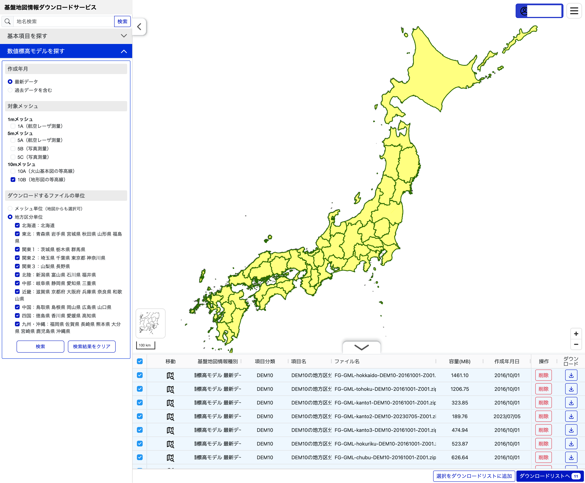

# 全国DEM10Bの準備

ローカルMVPで日本全国の地点を扱うため、国土地理院のDEM10Bを取得し、地形計算用の固定長タイルへ変換する。

## 取得

国土地理院の[基盤地図情報ダウンロードサービス](https://service.gsi.go.jp/kiban/app/map/?search=dem)から取得する。
ダウンロードには無料の利用者登録とログインが必要である。

1. 「数値標高モデルを探す」を開く。
2. 「過去データを含む」と、10mメッシュの「10B（地形図の等高線）」を選ぶ。
3. 「地方区分単位」で、北海道から九州・沖縄までの11区分を追加する。
4. 検索結果から、下記スナップショットとファイル名が一致する11個のZIPをダウンロードする。
5. ZIPを展開せず、`gsi/`直下へ置く。



画面は2026-09-02取得時の例である。画面上の「最新データ」ではなく、次のファイル名を再現条件とする。

### 検証対象スナップショット

本書では、2026-09-02に取得した次の組み合わせを「2026-09-02検証スナップショット」と呼ぶ。

```text
gsi/
├── FG-GML-hokkaido-DEM10-20161001-Z001.zip
├── FG-GML-tohoku-DEM10-20161001-Z001.zip
├── FG-GML-kanto1-DEM10-20161001-Z001.zip
├── FG-GML-kanto2-DEM10-20230705-Z001.zip
├── FG-GML-kanto3-DEM10-20161001-Z001.zip
├── FG-GML-hokuriku-DEM10-20161001-Z001.zip
├── FG-GML-chubu-DEM10-20161001-Z001.zip
├── FG-GML-kinki-DEM10-20161001-Z001.zip
├── FG-GML-chugoku-DEM10-20200409-Z001.zip
├── FG-GML-shikoku-DEM10-20200409-Z001.zip
└── FG-GML-kyushu_okinawa-DEM10-20200409-Z001.zip
```

各地域の配布日は同一ではない。地方区分ZIPの一部にはDEM10Aも含まれるが、変換器は内側のファイル名が`-DEM10B-`のデータだけを対象にする。

## 出典と利用条件

このプロジェクトでは次の表示を使用する。

> 出典：[国土地理院「基盤地図情報（数値標高モデル）DEM10B」](https://service.gsi.go.jp/kiban/app/help/)
>
> [国土地理院「基盤地図情報（数値標高モデル）DEM10B」](https://service.gsi.go.jp/kiban/app/help/)を加工して作成

基盤地図情報は基本測量成果である。[国土地理院コンテンツ利用規約](https://www.gsi.go.jp/kikakuchousei/kikakuchousei40182.html)に従い、出典と加工したことを表示する。

公開、配布、利用方法の変更前に、最新条件、申請要否、Web画面上の出典表示場所を人間が確認する。

- [基盤地図情報ダウンロードサービスのヘルプ・利用規約](https://service.gsi.go.jp/kiban/app/help/)
- [国土地理院の測量成果の利用手続](https://www.gsi.go.jp/LAW/2930-index.html)
- [地図の利用手続ナビ](https://service.gsi.go.jp/onestop/navi/index/)
- [国土地理院の出典記載例](https://www.gsi.go.jp/LAW/2930-meizi.html)

(確認日: 2026-09-02)

## 変換

Python 3.13以降の標準ライブラリだけで変換できる。

```bash
python3 terrain/scripts/convert_dem.py \
  gsi/FG-GML-hokkaido-DEM10-20161001-Z001.zip \
  gsi/FG-GML-tohoku-DEM10-20161001-Z001.zip \
  gsi/FG-GML-kanto1-DEM10-20161001-Z001.zip \
  gsi/FG-GML-kanto2-DEM10-20230705-Z001.zip \
  gsi/FG-GML-kanto3-DEM10-20161001-Z001.zip \
  gsi/FG-GML-hokuriku-DEM10-20161001-Z001.zip \
  gsi/FG-GML-chubu-DEM10-20161001-Z001.zip \
  gsi/FG-GML-kinki-DEM10-20161001-Z001.zip \
  gsi/FG-GML-chugoku-DEM10-20200409-Z001.zip \
  gsi/FG-GML-shikoku-DEM10-20200409-Z001.zip \
  gsi/FG-GML-kyushu_okinawa-DEM10-20200409-Z001.zip \
  --output gsi/derived-dem10b-v1
```

変換器は次を保証する。

- DEM10Bだけを変換する。
- 地方区分境界の重複は、内容が同一の場合だけ1枚にまとめる。
- 競合する重複はエラーにする。
- 入力ZIPの指定順によらず、メッシュ番号順のindexを生成する。
- 一時ディレクトリで完了してから最終出力を公開する。
- 既存の出力先を上書きしない。

`--limit 1`を付けると、全国入力の先頭1メッシュだけを別の出力先へ変換できる。

## 実測値

2026-09-02検証スナップショットの11個の地方区分ZIPをPython 3.13で変換した結果である。処理時間は実行環境により変わる。

| 項目 | 実測値 |
| --- | ---: |
| 入力ZIP | 11個、7,243,439,284バイト（約6.75 GiB） |
| 内側のDEM10B | 5,211エントリ |
| 重複除去後 | 4,885タイル |
| 変換済みタイル | 8,243,437,500バイト（約7.68 GiB） |
| `index.json` | 1,306,847バイト |
| 変換時間 | 34分30秒 |

元ZIPと変換済みデータを同時に保持するため、`gsi/`には約15.5 GBに加えて作業用の余裕が必要である。元ZIP、変換済みタイル、一時生成物はGit管理しない。

## 検証

タイル数、index、固定長、地理的な外接範囲、全セル中の欠損数を検証する。`--expected-tiles 4885`は2026-09-02検証スナップショットだけに適用する。

```bash
python3 terrain/scripts/validate_dataset.py \
  --data gsi/derived-dem10b-v1 \
  --expected-tiles 4885
```

全セル走査を省く場合は`--skip-missing-scan`を付ける。今回の全セル検証は約32秒であった。

| 項目 | 2026-09-02検証スナップショットの結果 |
| --- | ---: |
| 総セル数 | 4,121,718,750 |
| 欠損セル数 | 989,078,825 |
| 欠損率 | 約24.0% |
| 南端 / 北端 | 20.416666667 / 45.583333333 |
| 西端 / 東端 | 122.875 / 154.0 |

この緯度・経度は収録タイル全体の外接範囲であり、その内側の全地点に有効な標高があることを意味しない。

代表地点と欠損時の失敗動作を検証する。

```bash
python3 terrain/scripts/validate_locations.py \
  --data gsi/derived-dem10b-v1
```

旭川、盛岡、東京、長野、京都、津山、日田では西向きの地形評価が成立する。四国中央部、那覇、石垣では、観測地点の標高が存在しても50kmの西向きレイが欠損セルへ到達し、`DemNoElevationError`の`ray`として失敗することを確認する。これは実景との精度検証ではなく、計算結果と失敗動作の回帰検証である。

## カバレッジ上の注意

国土地理院はDEM10Bを全国整備としているが、本アプリが日本国内のすべての地点で地形評価を返せるという意味ではない。

- DEM10Bの欠損値から、海上と陸上のデータ欠損は区別できない。
- 観測地点が有効でも、9本のレイのいずれかが欠損または収録範囲外へ達すると評価全体を失敗させる。
- 沿岸部、半島、島では、最大50kmのレイが海域へ達しやすい。
- タイルの外接範囲だけから利用可能範囲を判断しない。

欠損値を0mとみなしたり、途中まで取得できた標高だけから視界を推測したりはしない。
