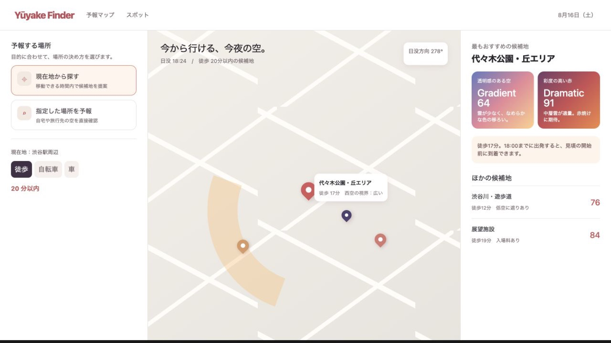
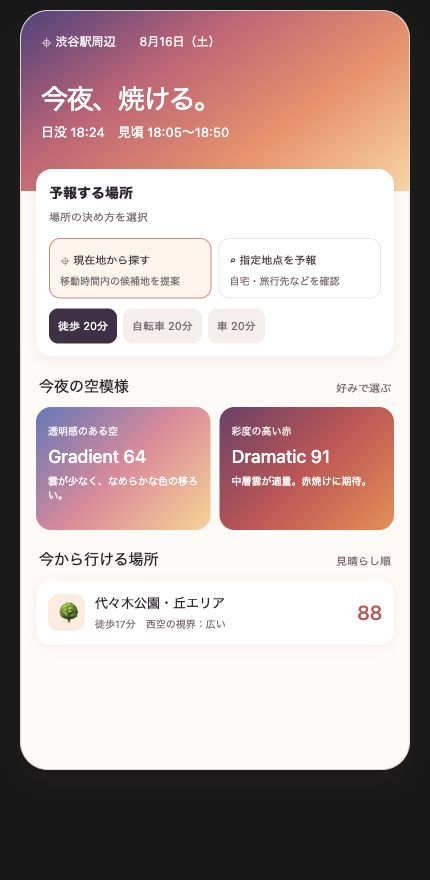

# Yūyake Finder 要件整理

> 実装対象となる初期版の範囲は [mvp-spec.md](mvp-spec.md) を参照する。本書は将来機能を含む全体構想である。

## 目的

ユーザーが「いつ・どこで・どのような夕焼けを見られそうか」を判断できるWebアプリを提供する。単に夕焼けの良し悪しを示すのではなく、空の見え方の好みと、実際に到達できる観賞地点を結び付ける。

## UI参照

画面構成・色・情報の優先順位は、以下のスクリーンショットを参照する。

### PC（FHD横長）

### モバイル

## 対象となる予報

- 今日、明日、明後日の夕焼け予報を表示する。
- 日没時刻と、観賞に適した時間帯を表示する。
- 天気だけでなく、雲量・雲の高度・視程・湿度・降水などを考慮する。
- 予報には不確実性があるため、直前更新の対象であることを明示する。

## 夕焼けスコア

予想スコアは総合値だけにまとめず、次の二種類を独立して表示する。

| スコア | 意味 | 主な評価要因 |
| --- | --- | --- |
| `Gradient` | 雲が少なく、橙・紫などの透明感あるグラデーションが出る期待 | 低層雲の少なさ、降水のなさ、視程、日没後の空の抜け |
| `Dramatic` | 雲を伴った、高彩度の赤・桃・紫の空が出る期待 | 中層・高層雲の適量、西方の雲の切れ目、日没後の雲、湿度・視程のバランス |

- 両スコアは 0〜100 点で表示する。
- 雲量が少ないほど常に高得点としない。雲がほぼない空は `Gradient` に有利だが、`Dramatic` には適量の雲が必要である。
- UIでは色調の異なる2枚のカードで並べる。
  - `Gradient`: 青紫・桃・橙の淡いグラデーション
  - `Dramatic`: 紫・赤・橙の濃いグラデーション

## 場所の決め方

ユーザーは、予報する場所を次の二経路から選べる。

### 現在地から探す

- ユーザーの現在地を起点にする。
- 徒歩・自転車・車のいずれかを選べる。
- 指定された所要時間以内で到達できる候補地を探索・提案する。
- 候補地ごとに以下を示す。
  - 到着所要時間
  - 西空の視界
  - `Gradient` / `Dramatic` の予報、またはそれらを統合した候補地評価
  - 日没前に到着するための出発目安
  - 入場料、営業時間、駐車場、低空の遮蔽物などの注意事項

### 指定した場所を予報

- 地名・施設名・住所・地図上の地点などから、予報したい場所を指定できる。
- その地点における日没時刻、空の見え方、遮蔽物を考慮した視界、`Gradient` / `Dramatic` スコアを表示する。
- 移動経路と候補地リストは表示せず、「その場所の予報」に集中する。
- 自宅、旅行先、気になる展望台など、現在地と関係なく調べたい用途を想定する。

## 移動時間の入力

「現在地から探す」を選択した場合のみ、移動時間を設定する。

- 移動手段の直下に所要時間セレクタを置く。
- 選択肢は `10分 / 20分 / 30分 / 45分 / 60分` とする。
- 初期値は `20分` とする。
- PCではプルダウン、または `− 20分 ＋` のステッパーで変更できる。
- モバイルでは、時間のチップを横並びまたは横スクロールで表示する。
- 時間または移動手段を変更した時点で、到達圏・地図・候補地リストを更新する。
- 車では、将来的に駐車時間を所要時間に含める詳細設定を追加できるようにする。

## 地形・遮蔽物の考慮

候補地や指定地点の評価では、日没方向の空が実際に見えるかを考慮する。

- 日ごとの日没方位と太陽高度を計算する。
- 建物の形状・高さ、地形の標高、候補地点の標高を利用する。
- 日没方位の前後およそ15〜25度について、地平線付近から空の可視率を算出する。
- 「夕日そのもの」と「日没後に染まる上空」を分けて評価する。
- 高台、河川敷、海岸、展望台、屋上など、見晴らしの良い地点を評価に反映する。

## 画面構成

### PC（FHD横長）

- `assets/ui-desktop.png` をUIの参照画像とする。
- 3カラム構成とする。
  - 左: 予報する場所の選択、移動手段、移動時間
  - 中央: 到達圏・候補地・日没方向を示す地図
  - 右: 選択地点の詳細、`Gradient` / `Dramatic` スコア、候補地リスト
- 現在地探索では中央に複数候補地と到達圏を表示する。
- 指定地点予報では中央を選択地点中心の表示に切り替え、右側にはその地点の視界・予報を表示する。

### モバイル

- `assets/ui-mobile.png` をUIの参照画像とする。
- 「予報する場所」を最上部のカードとして置き、二経路を明確に選べるようにする。
- 現在地探索を選んだときだけ、移動手段と移動時間を表示する。
- `Gradient` / `Dramatic` のスコアカードは横並びで表示する。
- 現在地探索時は、スコアの後におすすめ候補地を表示する。
- 指定地点予報時は、候補地リストを隠し、指定地点の予報と視界情報を表示する。

## データ・連携の想定

- 気象予報API: 時間別の雲量、雲の高度別情報、降水、視程、湿度、風
- 天文計算: 日没時刻、方位、高度
- 地図・経路API: 現在地、移動手段別の経路と所要時間
- 地形データ: 標高モデル
- 建物データ: 建物フットプリントと高さ。高さが不足する場合は階数などから補完する。
- スポットデータ: 公園、河川敷、海岸、展望台、屋上施設、橋など

## MVPの範囲

1. 今日から明後日までの `Gradient` / `Dramatic` 予報を表示する。
2. 現在地探索と指定地点予報の二経路を提供する。
3. 徒歩・自転車・車、および10〜60分の移動時間を指定できる。
4. 主要都市の候補地について、地形・建物による西空の視界を評価する。
5. PCとモバイルの両方で、場所の選択と二種類の夕焼けスコアをわかりやすく表示する。
